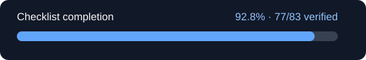

# Phoenix

A **ground-up reimplementation** of *Pegasus* — the cloud backend that powered the Jibo social
robot's conversation (ASR → NLU → skills → multimodal response). Phoenix is a clean,
modern-JavaScript rewrite; the original is used only as a **behavioral reference**, never
copied, and **no Jibo binaries ship** — the NLU engine, MIM dialog engine and every service are
reimplemented, with only plain-text data vendored (grammars, MIMs, word lists, manifests).

Jibo's cloud was shut down in 2019, which left every robot unable to hold a conversation.
Phoenix is a replacement those robots can actually talk to.

**Stack:** Node.js ≥ 20, ESM JavaScript, npm workspaces, one external dependency (`ws`).
Tests use the built-in `node:test` runner.

## Status

**Implemented in part. 1:1 compatibility is not yet verified, and the project does not claim
it.** A real robot connects over TLS, authenticates with its genuine credentials, holds a
conversation, and opens the native notification socket — though notification *delivery* is not
yet verified. The full behavioral comparison against the original still fails, and the headline
number below counts reviewed checklist tasks, not working features and not percent-complete
software.

The honest summary: the parser agrees with the original on **20,477 of 20,528** captured
requests, with 51 tracked residual differences; the complete corpus gate additionally has eight
external-service cases that neither side can host. Everything else is tracked openly.

<!-- parity-progress:start -->



**20.3% checklist completion · 16/79 tasks verified.**

Counts only tasks whose full acceptance criteria and evidence have been reviewed. Candidate implementations do not count. This includes planning and verification tooling; it is not a percentage of server functionality.

| Track | Verified | Total |
|---|---:|---:|
| Planning | 3 | 3 |
| Verification tooling | 4 | 4 |
| Pegasus | 3 | 46 |
| Companion cloud | 6 | 20 |
| Restoration | 0 | 1 |
| Release | 0 | 5 |

[Verified checklist](docs/parity/TASKS.md) · [Execution plan](docs/parity/PLAN.md) · [Behavioral comparisons](docs/parity/PRODUCTION.md)

<!-- parity-progress:end -->

Progress is regenerated from the task ledger by the repository's pre-commit hook.
`npm install` installs the hook; existing checkouts can run `npm run prepare`.

## What works

- **Conversation end to end** — WebSocket hub, server-side ASR, a JavaScript grammar engine,
  intent routing, graph-based skills, redirects and proactive selection.
- **Dialog content** — the complete 4,424 chitchat MIMs and 82 report MIMs.
- **Robot revival** — an OTA update server that walks a 2017 robot up to modern firmware in
  place, preserving per-robot calibration.
- **Pairing** — the real OOBE QR handshake for a factory-reset robot, and adoption for a robot
  that paired with the original cloud years ago.
- **Per-robot authentication** — the genuine SigV4 → hub-token exchange, verified against real
  hardware.
- **Notifications** — the native robot notification transport, connected over TLS.

## What still needs work

Calendar and OAuth, follow-up grammars, the personal report's robot displays, proactive
settings, and a number of Classic operations. Microphone/wake-word and physical-ring behavior
are unverified on hardware. See the [audit](docs/parity/AUDIT.md) for measured coverage and
specific defects, and [DIVERGENCES.md](DIVERGENCES.md) for deliberate departures.

## Layout

```
packages/
  contracts/   the frozen wire contracts — envelope, schemas, builders, validator
  common/      shared service scaffolding — env/service discovery, HTTP runner, JWT, logging
  harness/     verification — stream diff, corpus runner (D3/D4), SkillConversation + fixtures
  gateway/     hub — WS listen FSM, auth, server-side ASR (VAD+Parakeet), routing, proactive
  nlu/         parser — pure-JS grammar engine (FST semantics), eq_words, factory entities
  data/        lasso — weather/news/maps/calendar relays + credentials
  history/     skill-launch (IH query language) + speech history
  skills/      baseskill framework (GraphSkill, MIM factories, Slimmer, OptIn) + all skills
  ota/         OTA update server (extension) — serves firmware subsystems to a robot in place
  account/     account/loop/OOBE/settings Classic Service + web portal + per-robot hub auth
  classic/     the Classic-Service entrypoint — one front door for the robot's cloud API
```

## Quick start

```bash
npm install                      # links the workspaces; only `ws` is external
bash scripts/run-compose-stack.sh
```

Robots and clients connect to the hub at `ws://<host>:9000/listen`. The robot's cloud API
(OOBE, update, log, notification, …) is served by a single front door on `:9012`.

To go further:

| I want to… | Read |
|---|---|
| **Set up a server and point my robot at it** | **[Runbook](docs/RUNBOOK.md)** — step by step |
| Run it, expose it publicly, or use Docker | [Operations](docs/OPERATIONS.md) |
| Understand the robot's cloud API surface | [CLASSIC-SERVICES.md](CLASSIC-SERVICES.md) |
| See what is verified and what is not | [Checklist](docs/parity/TASKS.md) · [Plan](docs/parity/PLAN.md) |
| See how compatibility is measured | [Comparisons](docs/parity/PRODUCTION.md) |
| Know where Phoenix deliberately differs | [DIVERGENCES.md](DIVERGENCES.md) |

Run `npm test` for the full suite, and `npm run parity:status` for progress and the next
ready task.

## A note on the numbers

This project is deliberately conservative about claiming success. A task counts as verified
only when its complete acceptance criteria and evidence have been reviewed — candidate
implementations, passing unit tests and "it works on my robot" do not count. Expect the
checklist percentage to move slowly and to understate how much of the server functions.
That is the intent: the failure mode this project most wants to avoid is a confident claim of
parity that later turns out to be wrong.

**Reference:** [`jiboV2/pegasus@phoenix`](https://pvindex.org/gitea/jiboV2/pegasus) and its
`docs/atlas/`. [M9-REPORT.md](M9-REPORT.md) and [WORKLOG.md](WORKLOG.md) are historical.
