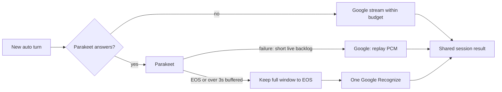

# Optional Google Speech-to-Text fallback

Implemented and tested offline, 2026-10-08. Google is **off by default**. No live
Google inference, credential installation, billing change, deployment or robot
comparison was performed. The owner checklist below precedes enabling it.

## Selection and the preserved contract

`PHOENIX_ASR_PROVIDER` selects `parakeet` (default), `google`, or `auto`.
Parakeet mode follows the original factory path without constructing a Google
client/router. Google mode never probes the GPU server. Auto uses Parakeet first
and Google when it cannot answer, within local usage limits. Recovery affects new
turns; a turn never switches back mid-window. The existing
`ETCO_server_asrProvider=google` legacy **mock** seam retains precedence; remove
that setting before using Cloud Speech through the new selector.

All modes use `ParakeetASRSession` for local endpointing, decoding, SOS/EOS,
wake-tail handling, empty-endpoint relisten, FAST_EOS, max-speech and cooperative
stop. The recognizer receives 16 kHz mono PCM16LE. OGG_OPUS uses the existing
ffmpeg decoder; FLAC uses the declared WASM decoder. No robot firmware or wire
schema changes are needed. Abort cancels queued audio and prevents late
callbacks, including a ready response racing abort in the same microtask turn.

Archive evidence: `jiboV2/pegasus`,
`packages/hub/src/asr/google/GoogleASRProvider.ts:createGoogleRequest` and
`GoogleASRSession.ts`. Original requests used V1 LINEAR16/16 kHz, robot language,
speech-context phrases, `singleUtterance:true`, `interimResults:true`, with no
explicit model/boost. The original used the first alternative, SOS/EOS and
FAST_EOS and could return its best incremental after a final wait. Phoenix's
existing Parakeet session already owns endpointing; the V2 adapter enables
interims without Google single-utterance or voice-activity endpointing. This is
a Phoenix provider extension, not evidence that original Jibo used Chirp.

## Exact text format and confidence

The target is deployed `nvidia/parakeet-rnnt-0.6b` output: lower-case ASCII letters
and apostrophes, single spaces, no punctuation/digits. The inherited tokenizer
inspection found 1,024 pieces containing only a-z, apostrophes and the
SentencePiece word-boundary marker, plus unknown. Source:
[NVIDIA model](https://huggingface.co/nvidia/parakeet-rnnt-0.6b).
The server applies `services/parakeet-asr/app/normalize.py:to_asr_text`; Phoenix
asks for `normalize:false`, preserving spoken numbers. That Python helper alone
permits more characters; the RNNT vocabulary supplies the narrower alphabet.
A future Parakeet model change requires revisiting this rule.

`transcriptNormalizer.js` processes every interim and final before FAST_EOS/NLU.
Its invariant is `/^(?:[a-z']+(?: [a-z']+)*)?$/`:

| Google text | Phoenix text |
| --- | --- |
| `Testing, testing, 1, 2, 3!` | `testing testing one two three` |
| `Set a timer for 5 minutes.` | `set a timer for five minutes` |
| `Don't wake-up Jibo.` | `don't wake up jibo` |
| `7:05 p.m.` | `seven oh five pm` |
| `$5.50` | `five dollars and fifty cents` |

This guarantees **format**, not identical decoded words or acoustic quality.
Inverse text normalization loses the spoken form: `105` might have been “one
hundred five” or “one hundred and five.” Deterministic fixtures pin US cardinal
numbers; 1100–2099 four-digit values read as years; AM/PM, times, decimals,
ordinals, money, percentages and digit sequences; retained abbreviations such as
`mr`/`ok`; and split hyphens. No filter can reconstruct discarded information or
force two models to hear the same words. Real command/grammar comparison remains.

Chirp alternative confidence is not passed as calibrated certainty. The adapter
supplies `null`; the shared session retains historical nonempty 1.0/empty 0.0
fallback. Legacy models' available confidence is word-weighted across confirmed
segments; a trailing interim makes it unavailable. These compatibility values
are not measured certainty. See
[Chirp 3](https://docs.cloud.google.com/speech-to-text/docs/models/chirp-3) and
[Chirp 2](https://docs.cloud.google.com/speech-to-text/docs/models/chirp-2).

## API, models and limits

Default: Speech-to-Text **V2**, `chirp_3`, `us`, `en-US`. StreamingRecognize and
synchronous Recognize are supported. Canadian-English robots use `en-US`, as the
current Parakeet deployment has one English model. Chirp 3's documented GA
endpoints are US/EU multi-regions. Chirp 2 uses `us-central1`, `europe-west4` or
`asia-southeast1`; its page labels availability Private GA, so check project
access. Admin and router reject incompatible Chirp model/location pairs.
Legacy `short`, `long`, `telephony`, `telephony_short` environment choices require
an operator region/language check; the UI offers Chirp 3/2 only. No accuracy or
latency superiority is asserted.
[Model selection](https://docs.cloud.google.com/speech-to-text/docs/transcription-model).

Requests disable automatic punctuation and profanity masking, request one
alternative and interims, and send existing expanded ASR hints (including `jibo`)
as an inline phrase set without boost. Hints are deduplicated/bounded to 500
phrases of 100 characters; optional boost is capped at 20. Denoising is off until
room/microphone testing; it does not replace VAD. No diarization, word timings,
translation, GCS upload, BatchRecognize job or data-logging opt-in is requested.

The first streaming request is `{recognizer, streamingConfig}`, later requests
are `{audio}`. The implicit recognizer is
`projects/PROJECT/locations/LOCATION/recognizers/_`. Pinned optional
`@google-cloud/speech@8.1.1` requires **Node 22+**, loads on use and is initialized
before exposing methods. Generated SDK calls can rethrow bootstrap rejection;
awaited initialization prevents an unhandled rejection terminating Hub. The SDK
convenience streaming helper wraps V1 `audioContent`; Phoenix drives V2
`_streamingRecognize`. Unary retries are disabled. Offline tests encode actual
SDK protos and inject a failed local stub under strict rejection handling.
[Node V2 reference](https://docs.cloud.google.com/nodejs/docs/reference/speech/latest/speech/v2.speechclient-class),
[SDK package](https://github.com/googleapis/google-cloud-node/blob/main/packages/google-cloud-speech/package.json).

Streaming, including replay, is paced at real time in 6,400-byte/200ms chunks.
The hard request cap is 15,000 bytes, fitting both the Node reference's 15 KB and
the quotas page's 25 KB. Stream windows are bounded to 31s; the shared session
buffers at most 30s. Synchronous audio is limited to 60s. Eight process-wide
streams produce about 2,400 audio messages/min below the documented 3,000/min
allowance; other clients share project quotas.
[Quotas](https://docs.cloud.google.com/speech-to-text/docs/quotas).

## Failure and recovery



Auto deadlines: 1.5s health, 2s socket open, 2.5s primary final after EOS, 6s primary
batch. A reachable legacy primary without streaming retains its batch path.
Refused/invalid health, stream error/close or missing final can trigger fallback.
The session retains accepted PCM. Short live failures replay start/all PCM in
order and continue new audio; stale primary events/duplicate finals are ignored.
Ended windows and live failures with over 3s already buffered use synchronous
Google at EOS, avoiding another 20–30s paced replay. A Google error/end before
actual half-close retries the full window; after complete submission, available
confirmed text plus trailing hypothesis can settle without resending. Each
attempt is accounted separately.

The original Parakeet 30s final waiter and Hub 40s ASR timeout remain. Google uses
that 40s turn limit with a 250ms margin: bootstrap (up to 2s), streaming and batch
(up to 10s) fit remaining time. No new paid request starts with under 1s left.
Google final wait is up to 5s after actual half-close. An already submitted unary
RPC cannot always be cancelled remotely; abort ignores its response and counts
full audio conservatively. Local cancellation does not claim a provider refund.

Down primaries are probed every 10s; two consecutive successes restore new turns.
A failure within two minutes of recovery doubles the interval, capped at five
minutes. Google credential/configuration/SDK errors pause it for five minutes.
New diagnostics carry reason enums/counts, not raw provider messages or text.
Missing configuration/budget/state leaves auto on the ordinary Parakeet error
path; manual Google returns ASR failure. Retired routers drain active turns before
closing clients and share stream admission across generations. Late startup
probes cannot open streams after batch owns finalization.

## Credits, cost and hard stop

AI Pro currently includes **$10/month Google Cloud credit**. Activate it in
[My Benefits](https://developers.google.com/program/my-benefits), choose the
billing account attached to the Speech project and optionally select “Always
use this billing account” for recurring application. A promo code can instead
be redeemed in [Cloud Billing](https://console.cloud.google.com/billing/redeem).
Redemption needs `billing.accounts.redeemPromotion`. Credits cover Cloud
products; Speech eligibility is inferred from this general scope and must be
confirmed against the actual benefit/SKU in Billing. Credits expire one year
after grant. The distinct $50 GenAI benefit is limited to AI Studio/Vertex.
[Benefit terms](https://developers.google.com/profile/help/benefits),
[plans](https://developers.google.com/program/plans-and-pricing).

Current V2 standard price is $0.016/audio minute, rounded up to a second per
request. Empty successful responses are billable. Server failures are not, but
Phoenix counts uncertain/error attempts conservatively. Dynamic batch's cheaper
price is not used for interactive turns.
[Speech pricing](https://cloud.google.com/speech-to-text/pricing).

| Monthly audio | Estimated Speech charge | Five-second requests over 30 days |
| --- | --- | --- |
| 625 minutes | $10.00 | 7,500 / 250 per day |
| 560 minutes (default cap) | $8.96 | 6,720 / 224 per day |
| 100 minutes | $1.60 | 1,200 / 40 per day |

Calculations include **sent audio**, endpoint silence/wake tails, independent
rounding and retries. Other products/projects, taxes and price changes may use
the same credit. The $1.04 margin is not a zero-invoice guarantee.

Monthly cap defaults to 560min; daily defaults to one tenth, rounded up (56min).
Monthly zero disables Google; daily zero disables only the daily cap. Explicit
malformed/negative/unsafe caps disable Google. Periods are Pacific calendar
day/month. The meter durably reserves 31s before a stream or actual rounded PCM
duration before batch **before client dispatch**, then commits the greater of
provider billed duration and PCM estimate. Unsent audio is refunded; retry
attempts count separately. Short batches can fit budget when a full stream cannot.
Logs warn once at 50/80/100%; status distinguishes used/reserved seconds.

The private ledger uses fsync, atomic replacement and per-file cross-process
locking. All Hub processes must share the same local durable file; this is not
a distributed NFS/multi-host budget service. Missing/corrupt/unreadable/unwritable
or locked state refuses Google. Reservations survive crashes/restarts and carry
forward conservatively at period boundaries. Backward clocks refuse instead of
resetting spent usage. Orphan holds/stale locks need operator reconciliation
against Billing; never delete/recreate a ledger to bypass the cap. Compatible
v1 state retains usage on upgrade. Initialization is exclusive-create, once.

Set actual/forecast Billing alerts, for example $8/$9/$10, and inspect credit
balances. Ordinary budgets are alerts, not a hard Speech shutoff. Google's
current spend-cap feature supports other products, not Speech. The local ledger
stops this Phoenix provider's admission; it cannot stop other clients or observe
remaining credit automatically.
[Spend-cap scope](https://docs.cloud.google.com/billing/docs/how-to/budgets-spend-caps).

## Credentials, privacy and installation

The official client's ADC-compatible **credentials file** is
`PHOENIX_GOOGLE_STT_CREDENTIALS_FILE`, falling back to
`GOOGLE_APPLICATION_CREDENTIALS`. No API-key-only path is implemented. Prefer
Workload Identity Federation for an external server when feasible; a private
service-account JSON key is simpler. Runtime identity needs `roles/speech.client`
on the project, not broad project administrator roles. Project/billing linkage, IAM grants
and enabling `speech.googleapis.com` are separate owner/admin setup.
[Authentication](https://docs.cloud.google.com/speech-to-text/docs/v1/authentication),
[Speech roles](https://docs.cloud.google.com/iam/docs/roles-permissions/speech).

Keep credentials outside Git/releases/logs/public artifacts/images, readable only
by the service identity; never paste contents into admin. Google receives audio
and hints, possibly household names. Keep data logging opt-in disabled. Google's
published FAQ describes in-memory streaming/sync processing and temporary request
metadata; confirm current terms/endpoint before consent. Phoenix stores counts
only in this ledger; status excludes identities/paths/text/raw errors. Existing
optional speech-history policy remains.
[Data usage FAQ](https://docs.cloud.google.com/speech-to-text/docs/v1/data-usage-faq).

Native: use Node 22+ and normal `npm ci`; the pinned optional SDK survives staging.
Do not omit optional dependencies when enabling Google. Install server-owned
credential/ledger paths in the launcher's environment. Console overrides apply
editable keys; those paths remain server-owned. Initialize once as the service
identity from reviewed code:

```sh
node scripts/init-google-stt-usage.mjs /var/lib/phoenix/asr/google-stt-usage.json
```

The directory must permit private atomic replacement/lock creation; credential
0600 and state directory 0700 are appropriate. Keep the same ledger across
deploy/rollback. The initializer refuses existing files and never calls Google.

Compose: default runtime stays Node 20. Add `-f deploy/google-stt.compose.yml` to
normal Compose files for an explicit opt-in. Hub then builds a separate
`phoenix-google-runtime:local` Node 22 image; credentials bind read-only at
`/etc/phoenix/secrets/google-speech.json`, state at `/var/lib/phoenix/asr`.
Provide existing host paths in `PHOENIX_GOOGLE_STT_HOST_CREDENTIALS_FILE` and
`PHOENIX_GOOGLE_STT_STATE_DIR`. Initialize ledger on the host; container node
UID/GID 1000 needs credential read and private state-directory write access.
Federation may need its token source additionally mounted; this companion does
not provision one.

Admin → Settings → Speech exposes provider/project/model/location, minute/stream
caps, denoising and hint boost. Saves affect Hub after restart; overview shows
**running** mode, primary health and usage. Saved/running modes may differ until
restart. Status uses an admin session and server HMAC/nonce proof to a fixed Hub
endpoint. Existing launcherless Compose consoles keep settings read-only; use
their environment configuration.

On the active native server, use only
`scripts/deploy-native-release.sh <reviewed-commit>`, with fresh Hub+OTA activity
and a full idle minute, including provider changes/rollback. Do not use direct
service/console restart or symlink switch. Set `PHOENIX_DEPLOY_RUNTIME_DIR` when
needed. See [DEPLOYMENT.md](DEPLOYMENT.md) and [RUNBOOK.md](RUNBOOK.md).
This lane does not authorize deployment or paid inference.

## Operator/root checklist

1. Review commits/evidence, retain `parakeet` through integration. Check Node 22+,
   pinned SDK and the selected model/region.
2. Operator: confirm credit entitlement, redeem to correct billing account, attach
   Speech project, enable V2, create least-privilege credentials and Billing alerts.
3. Operator: install credentials privately; initialize ledger once; check service
   permissions and shared durable path. Start with default 560/56min or a smaller
   explicit validation cap.
4. Root: review/stage/activate native or Compose configuration only under the
   authorized release guard and fresh idle Hub+OTA activity.
5. With separately authorized paid inference, use synthetic audio first. Check
   normalized interim/final, region access, billed metadata, ledger/status/Billing,
   invalid-key pause and no-dispatch budget/state refusals. Restore Parakeet with
   the same guarded workflow.
6. With separately authorized hardware use, compare quiet/noisy command accuracy,
   US/Canadian English, names, numeric alarms/timers, FAST_EOS, max-speech, wake
   tails, empty relisten, stop/abort, long failover and recovery. Record consented
   private latency/accuracy evidence before enabling denoise/boost. Equal quality,
   real credentials/region access, credits/billing, provider cancellation and
   hardware behavior are **not verified offline**.

## Offline verification

```sh
node --test --test-concurrency=3 packages/gateway/test/asr*.test.js \
  packages/gateway/test/listen*.test.js packages/gateway/test/voiceTurnTelemetryApi.test.js \
  packages/account/test/admin*.test.js
npm run parity:check
```

Coverage: normalization tables/invariant, request/proto/SDK bootstrap; default,
healthy/manual isolation; startup, live, ended and 29s-before-EOS failures with
full PCM equality; recovery; real-time pacing/pre-half-close error/end and
confirmed-plus-interim salvage; FAST_EOS, empty relisten, OGG_OPUS/FLAC;
cancellation races/late-probe ownership/router drain/shared admission; durable
reservations/crash/restart/clock rollover/corruption/locking; deadline/short-budget
admission; admin validation/server-owned paths/proof replay/privacy. These prove
local behavior and mocked protocol handling, not Google's acoustic output.
