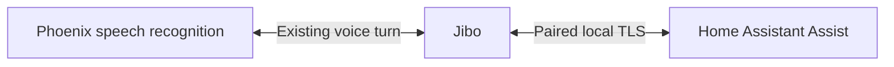

# Home Assistant through a direct Jibo connection

The [Phoenix integration](https://github.com/Paskooter/phoenix-home-assistant) connects Home Assistant directly to each paired Jibo over authenticated local TLS. Phoenix supplies speech recognition and ordinary Jibo skills. Pairing credentials, Home Assistant addresses, device results and uploaded media remain on the local connection.

Integration **0.4.0b1** with **BE 13.3.0** adds single-code pairing and opt-in robot controls. Services **13.0.8** and OS **13.0.7** remain the baseline. The preceding [0.3.0b3](https://github.com/Paskooter/phoenix-home-assistant/releases/tag/v0.3.0b3) passed physical pairing, genuine voice-controlled light on/off and all 15 live sensors. See the integration's [validation record](https://github.com/Paskooter/phoenix-home-assistant/blob/main/docs/validation.md) for this candidate's exact hardware evidence.

## Owner setup

1. Apply the compatible robot release. In HACS, add `Paskooter/phoenix-home-assistant` as an Integration, enable prereleases, install **0.4.0b1** and restart HA. Tested HA versions are **2026.8.1** and **2026.9.4**.
2. On Jibo, open **Settings → Home Assistant → Start pairing**. In HA, add Phoenix and enter his local address and the eight digits on his screen within two minutes. TCP **9443** must be reachable locally.
3. Both devices finish automatically. **Done** returns Jibo to his face; **Manage** separates deliberate replacement and confirmed disconnection.
4. Assign Jibo an HA area and expose devices to Assist. Use the built-in `home_assistant` conversation agent, or explicitly choose an installed agent such as [Jev](https://github.com/Paskooter/ha-conversation-jev).
5. In **Phoenix → Configure**, enable the robot permissions you want. Announcements, screen, ring, audio, sleep, skills and camera start off.

Each robot has its own pairing. HA uses Jibo's locally stored nickname or actual native four-word name, while preserving an explicit HA device name. Existing direct links survive an upgrade without pairing again. No public HA URL, port forwarding, HA access token or console pairing code is needed.

For removal, remove the Phoenix entry while Jibo is reachable. If removal cannot confirm revocation, use **Settings → Home Assistant → Manage → Disconnect** on Jibo and confirm. Disabling an entry stops its socket but does not revoke its credential. Disconnect keeps direct mode selected and cannot reactivate the legacy cloud connector.

The complete [installation and migration guide](https://github.com/Paskooter/phoenix-home-assistant/blob/main/docs/installation.md) covers HACS, manual ZIP installation, certificate/address changes, cloud migration and ownership transfers. The console provides guidance and separate management of old cloud links; it never receives local pairing keys.

## Voice routing

Named and room lights, switches, brightness, supported colors, named scenes and scripts retain the focused command set. Native routing also recognizes common household device names; when those rules miss, JEV’s smart-home decision may route the exact recognized transcript during an already admitted native wake. Delayed requests and command sequences are refused before execution. Local state questions, HA areas, bounded follow-ups and exact exposed routine shortcuts are also supported. “Ask Home Assistant to…” explicitly selects custom Assist sentences before execution. The executing conversation API is never used to probe arbitrary utterances.

Gateway validates the bounded `context.data.phoenix_local_home` preference only for its verified robot socket identity and returns recognized text using the existing native skill envelope. Routing preferences, household IDs, context and tracing fields cannot authorize a household. A local-mode declaration suppresses the old cloud connector, including when malformed; there is no silent cloud fallback.

The robot requires a genuine admitted local turn before sending a home request. Cloud hints cannot open or extend a turn, supply a credential or substitute a transport endpoint. Ordinary time, volume, sleep, jokes, weather, cancellation and responses inside active skills retain precedence. Robots without local enrollment keep their existing Hue routes.

Operator-provided firmware and Phoenix speech recognition remain trusted. The direct design removes the operator's standing server connector authority over HA. It does not provide offline or private speech recognition. Local controls, announcements and connection status use the paired LAN connection independently of Phoenix.

## Robot entities and controls

All 15 requested sensor roles are present: battery, battery temperature, camera activity, charging, CPU temperature, fan speed, hatch, head touch, main-board temperature, microphone RMS, online, plugged in, sleeping, speaker volume and system voltage. Missing or stale readings are unavailable rather than invented.

The new controls provide bounded plain screen text and local PNG/JPEG display, RGB ring light, master volume, local PCM16 WAV playback with pause/resume/stop, native sleep/wake, a closed catalog of installed Clock/Radio/Yoga/Word of the day skills, and Stop for integration-owned activity. The [robot controls guide](https://github.com/Paskooter/phoenix-home-assistant/blob/main/docs/robot-controls.md) gives actions, limits and automation examples.

Camera preview requires its independent permission, a fresh closed-hatch reading, an idle robot and explicit activation. Jibo shows a camera notice. Sessions last at most 60 seconds. Native continuous VP8/WebM video travels through the paired TLS endpoint; Home Assistant decodes it into the camera entity’s live MJPEG feed. JPEG snapshots remain available without gallery storage. Touch, hatch opening, new robot activity, disconnect or permission removal stops owned capture. Microphone streaming, arbitrary Nimbus execution and an HA weather-launch action are not provided.

## Pairing, privacy and reliability

The robot generates its own TLS identity and installation credential. The new physical-code flow uses mutual SRP proofs bound to both fresh endpoint values and the actual certificate; the displayed code is never sent as plain text. Windows expire, guessing is bounded, and completion recovery cannot create a second pairing. HA pins the verified identity; discovery or an IP change cannot replace the pin. Replacement/revocation closes the old session.

Confirmed native-credential changes revoke pairing; unreadable credentials pause access. Phoenix account reassignment alone can preserve native credentials and cannot transfer or erase an independent local pairing. Before transferring a robot, complete physical Disconnect and remove the old HA entry.

Protocol 2 binds frames to the pairing generation and fresh session UUID. Every action has an ID and deadline; durable admission precedes execution. Expired and duplicate work is discarded. Reconnect and restart never queue or replay actions. Lost replies mean uncertainty, never definite success or an automatic action retry. Speech uses plain text escaped for ESML. Local media uploads are bounded, memory-only, short-lived and consumed once.

## Server and release operations

Keep Gateway authentication and Account mappings enabled. The direct connection needs no cloud HA proxy, public WebSocket connector, household credential or signing secret. The console no longer creates cloud connection codes. Existing legacy collections and routes stay intact for older installations and safe rollback; see [legacy storage](HOME-ASSISTANT-CLOUD.md#authentication-and-storage).

Actual voice work participates in the existing transaction lifecycle. Local sockets and heartbeats do not create persistent server transactions or prevent the deployment quiet minute. Deploy only through `scripts/deploy-native-release.sh <commit>` with fresh Hub/OTA state, the correct runtime directory and a full 60 continuous quiet seconds.

Keep complete BE source and artifacts in the private `jibo-be` project. SSH staging and native System Manager launch are appropriate for designated development hardware. Publish an OTA only from the complete committed build after the hash-pinned official 11.0.1 integrity gate and hardware acceptance; never use an installed robot tree or old payload as the build base.

## Validation

The 0.4.0b1 source passed **123 tests on each supported HA version**, including actual built-in conversation, Jev with intercepted provider HTTP, lifecycle/reconnect/revocation, all 15 sensors and the real private endpoint on official **Node 6.5.0**. Public fixtures are synthetic. New native controls passed **211 host tests**. The BE 13.3.0 archive gate found **21,590 official files**, **21,628 candidate files**, **38 additions**, zero missing files and zero unresolved package mains.

The complete SSH candidate launched on the designated robot, returned to normal idle and preserved its existing pairing identity/profile. The initialized native adapter exposed all eight capabilities and four installed skill choices; all 13 checked installed runtime files matched the committed source. New physical pairing/control acceptance and observed latency are recorded separately in the integration's validation guide. Software fixtures and a running process are never presented as physical device evidence.
