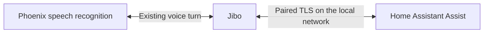

# Home Assistant through a direct Jibo connection

The direct release connects the [Phoenix integration](https://github.com/Paskooter/phoenix-home-assistant) to each paired Jibo on the owner's local network. Home Assistant initiates an authenticated, encrypted connection to the robot; Phoenix provides speech recognition and ordinary Jibo skills. Home Assistant addresses, credentials, device results and robot pairing keys are not sent to the Phoenix connector.

The direct beta is published as integration **[0.3.0b3](https://github.com/Paskooter/phoenix-home-assistant/releases/tag/v0.3.0b3)** (2026-10-06), for BE **13.2.2**, services **13.0.8** and OS **13.0.7**. On one robot with HA 2026.9.4, physical pairing, genuine voice-controlled light on/off, ordinary Jibo speech and all 15 sensors passed; the other command features have software coverage. Direct announcement playback/interruption and continuity during a Phoenix restart are not yet physically accepted. The [0.2 cloud beta](HOME-ASSISTANT-CLOUD.md) remains for existing installations until their owners migrate; the console no longer issues cloud connection codes. Do not interpret candidate code or a running SSM flag as physical acceptance.

## Owner setup

1. Install the tested robot update and Phoenix through HACS. Enable beta versions for this release, then restart Home Assistant.
2. Open **Settings → Devices & services → Add integration → Phoenix** in Home Assistant first, then **Settings → Home Assistant → Start pairing** on Jibo; the pairing window lasts 120 seconds. Enter the host and port Jibo shows in Home Assistant. Both must be on reachable local networks; no public Home Assistant URL or port forwarding is needed.
3. Compare the eight digits shown on Jibo and in Home Assistant. Approve on Jibo only if they match, then confirm in Home Assistant. Repeat for each robot.
4. Choose devices using Assist exposure controls. Select the built-in `home_assistant` conversation agent or an explicitly chosen installed agent such as [Jev](https://github.com/Paskooter/ha-conversation-jev).
5. Manage connection health, area assignment, routines, quiet hours and announcement permission in Home Assistant. Remove an entry to disconnect; when offline, also use Jibo's local Forget control.

The exact installation, migration, command and removal instructions live in the integration's [installation guide](https://github.com/Paskooter/phoenix-home-assistant/blob/main/docs/installation.md). The console's **Home Assistant** page is a guided checklist for this pairing; owners can tick steps off in their own browser, and the console never shows that as pairing status. It cannot pair the local channel or access its keys. Older cloud links have a separate page for their status, announcement permission and disconnection. That page no longer issues connection codes, which Phoenix 0.3 and later cannot use, and the Home Assistant page says when older links remain.

## Routing and voice behavior

Named and room lights, on/off switches, brightness, supported colors, and named scenes/scripts retain the focused first-release command set. State questions, HA-assigned areas, bounded follow-ups and exact exposed routine shortcuts remain local integration features. An explicit “ask Home Assistant to…” invocation selects a custom Assist sentence before execution. Arbitrary utterances never probe the executing conversation API.

The robot publishes a bounded `context.data.phoenix_local_home` routing preference. Gateway validates that preference only for its verified robot socket identity, selects a native `@be/home-assistant` handoff, and returns recognized text in the existing NLU envelope. A declaration is routing information, never household authorization. Any local-mode marker suppresses the old cloud connector path, including malformed markers; there is no silent cloud fallback.

The native robot validates the local turn and route before sending a command to its paired Home Assistant. Cloud route hints cannot open a turn, extend its expiry, provide a Home Assistant credential, or substitute an arbitrary transport endpoint. Native commands such as time, volume, sleep, jokes, weather and cancellation retain precedence; replies inside active skills stay with that skill. Robots without local enrollment retain their existing Hue and ordinary routes.

Firmware supplied by the operator and Phoenix speech recognition are trusted. Phoenix can still see and interpret spoken requests. This release removes the server connector's direct authority over Home Assistant; it does not provide offline or private speech recognition. Local announcements and connection health use the direct connection independently of Phoenix.

## Pairing and reliability

The robot generates its own local identity, TLS key and installation-specific credential. A short authentication string binds the physical approval to both endpoints' fresh commitments and the actual TLS certificate. Pairing windows expire and allow one candidate. Home Assistant pins the approved certificate; an IP change does not replace that identity. Credential replacement/revocation closes the old session. Confirmed local native-credential changes revoke the pairing; temporarily unreadable credentials pause access. Phoenix account reassignment can preserve native credentials and cannot transfer or erase this independent local pairing. Before transferring Jibo to another owner, complete physical Forget and remove the old HA entry.

Protocol 2 binds every frame to the approved generation and fresh session UUID. Commands have unique request IDs and bounded deadlines. Durable admission precedes execution, duplicate/expired work is discarded, and disconnected requests are never queued or replayed. A lost response is uncertain: Jibo says he could not confirm the result and does not execute it twice. Partial outcomes and unavailable devices are reported honestly. Speech is escaped as plain ESML text before native delivery.

Direct mode persists separately from pairing credentials. Forget, revocation, restart, lost credentials or network failure cannot silently reactivate cloud Home Assistant control. Legacy integration upgrades wait for local pairing, retain agent/routine/quiet-hours options, and require a fresh local announcement opt-in. Successful migration removes the old cloud credential and attempts its revocation. Offline cleanup has explicit instructions.

## Server operations

Keep Gateway authentication enabled and its Account mapping current. Household IDs, context fields and tracing headers are not authorization. The direct channel needs no public Home Assistant WebSocket route, proxy, signing secret or household credential. Existing Account collections and legacy routes remain intact for older installations and safe rollback; see the [legacy storage requirements](HOME-ASSISTANT-CLOUD.md#authentication-and-storage).

Deploy only through `scripts/deploy-native-release.sh <reviewed-commit>`, with the correct `PHOENIX_DEPLOY_RUNTIME_DIR`, fresh Hub and OTA activity and sixty continuous quiet seconds. Actual speech-recognition/native handoff work uses the existing voice transaction lifecycle. Direct LAN sockets and heartbeats do not create persistent cloud transactions or prevent the quiet minute.

BE source and artifacts remain in the separate private `jibo-be` project. Build from its complete committed tree and pass the hash-pinned official 11.0.1 integrity gate before offering an OTA. Services adds only the narrow Home Assistant firewall modes, preserving independent SSH and remote-operation choices. Existing firmware update trust is unchanged.

## Validation

Integration **0.3.0b3** passed **93 tests on each of actual HA 2026.8.1 and 2026.9.4**, including the real private endpoint on official Node 6.5.0. Fresh installation from the exact 20-file release ZIP, unload/reload, a distinct process loading persisted credentials and the request ledger, revocation and removal also passed on both versions. The source matrix took **132.07 / 140.10 seconds**, and archive lifecycle **5.348 / 4.364 seconds**. [CI for integration source `40ce56d`](https://github.com/Paskooter/phoenix-home-assistant/actions/runs/37341339650) passed HACS, hassfest and both HA jobs, each with **92 passed / 2 private endpoint cases skipped**. Those two cases are covered locally. A new regression checks announcement denial before an authenticated permission roster and confirmed delivery afterward; the test synchronization correction leaves the release ZIP unchanged. Public fixtures use invented devices and identities; Jev provider HTTP was intercepted. These are software checks, not physical direct-session acceptance.

BE **13.2.2** passed **162 host tests**, **six native layout cases** and **fourteen pairing UI cases on official Node 6.5.0**. Layout checks execute the shipped GUI components and PIXI wrapping/font fitting with conservative invented glyph measurements. All nine pairing screens keep text clear of the full 264-pixel button areas, including their activated size. Controls and security checks are unchanged; actual screen rendering remains a hardware check.

The preceding BE **13.2.1** passed **156 host tests** and **14 pairing UI cases on official Node 6.5.0** using the vendor view-transition implementation. Six regression cases failed against the old Settings source and passed with the fix. The correction coalesces Home Assistant screen updates until the active view transition finishes, preventing a concurrent update from closing Settings and canceling pairing.

The complete archive built from committed BE **13.2.2** source (`422a26e1`) passed the independent official 11.0.1 gate: **21,590 official files**, **21,617 candidate files**, **27 additions**, no missing official files, and **zero unresolved package entry points**. Independent review checked all **23,685 inner archive entries** against the committed source and preserved runtime dependencies. The official archive supplied the comparison, while the complete committed tree supplied the build. The 173,393,920-byte tar has SHA-256 `1654a87e2a0acf6d59d1a2c7ff0379e58d9c5907fef4409c02cefda7e74430a9`.

On **2026-10-06**, an isolated HA **2026.9.4** installation paired with the updated robot through its physical **Start pairing** and **Approve** controls; the corrected screen showed the host, countdown, all eight digits and the approval controls without overlap. All **15 sensor roles**, including authenticated **Online**, delivered live readings over the paired connection. The owner spoke genuine light-on and light-off commands: passive capture recorded both native wake/start/result sequences and successful local HA processing, and the owner confirmed the approved light changed and that ordinary wake/time speech worked. The last HA response took **826.9 ms**, which excludes wake detection and cloud speech recognition. No native approval, wake or recognition event was injected. See the integration's [validation record](https://github.com/Paskooter/phoenix-home-assistant/blob/main/docs/validation.md).

After the BE **13.2.2**-only native update, a separate normal-mode reboot completed on **2026-10-05**. All **21 installed source-hash checks** matched the reviewed release before and after reboot; OS, Services and OOBE stayed unchanged, with no pending OTA. Its actual **Electron 1.4.3 / Node 6.5.0** renderer displayed the complete native UI and normal face. The local controller, access mode and persisted certificate hash were healthy. A temporary in-memory telemetry reader returned valid non-null values for all **fourteen measurement fields**, then was destroyed. This performed no pairing, wake, speech or home action and does not establish the fifteenth Online entity or sensor delivery through a physically paired HA session. The preceding BE 13.2.1 passed normal startup, but its physical Cancel button obscured the countdown; the BE 13.2.2 layout fixed that overlap, as the 2026-10-06 session confirmed.

Run focused Gateway local-routing/authentication/ordinary-command tests, legacy Account compatibility tests, deployment guard tests and browser setup checks. In the integration repository, run its documented direct protocol tests against real isolated Home Assistant versions and synthetic devices. The native endpoint must also pass actual Node 6.5 startup, TLS/pairing, replay/deadline, cancellation and storage-failure checks.

The physical session covered pairing, named light on/off by voice, ordinary speech and sensors. Brightness, colors, scenes, scripts, room context, state questions, routine phrases and follow-ups have software coverage only. Direct announcement playback and interruption, and continuity during a Phoenix restart, still need physical acceptance. Record actual versions and measured latency; supplied-ASR tests do not establish fresh microphone wake behavior. This validation is not a claim that all legacy Phoenix tests pass.
