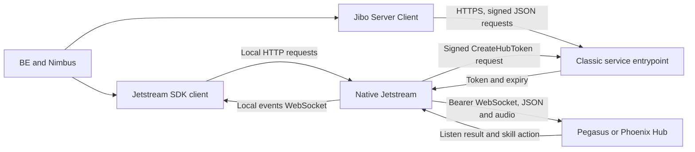

# Robot consumer contracts

The current validation strategy uses original Pegasus behavior and pinned robot
consumer source. **The web simulator is not a parity oracle.** The user made Moth available on 2026-09-05 and authorized real-robot
iteration; see [HARDWARE.md](HARDWARE.md). The earlier source-only audit contacted
no robot; the subsequent Moth run now has verified SSH access. The simulator startup probe
was stopped, with no completed journey or parity credit.

The user's [Jibo Server Client guide](https://pvindex.org/docs/guide/readme.html)
identifies an AWS JavaScript SDK fork that retains signing and retry machinery
for Jibo services. Phoenix can run outside AWS while preserving that client
contract. Classic service requests and the Hub's conversation WebSockets are
distinct transport paths; both matter for an unchanged robot.

## References recovered and verified

| Profile | Exact reference | What is established |
|---|---|---|
| Original Pegasus | `5c0a7390539663ba749d360de348a428c088505c` | Frozen server behavior remains the primary target. |
| Hashbrown SDK | `sdk/sdk@793e5ae469ec48d280bf837564035696848629ab`, tag `v23.4.0`, 2018-05-23 | Package manifests confirm BE `10.0.16`, Jetstream client `2.2.0`, Nimbus `2.2.7`. |
| BE 12 release | [jibo-be-12.0.0.tar.gz](https://pvindex.org/repository/skills/jibo-be/jibo-be-12.0.0.tar.gz), SHA-256 `e29f476c75e35e9bbd07c0211c75e2385772e4dfb3dd079a1d832e3832450657` | Independently verified 192,233,932-byte archive. The Hermes project's `SOURCE.md` supplied the discovery lead; the modified Hermes tree is not the reference. |
| Native Jetstream | `jiboV2/jetstream@01ae81fc366ccd6e68ca66fa98f77f957dcdb1fb`, 2018-05-30 | Original source before the archive's 2026 URL migration. This establishes inspected code, not the binary installed on either robot. |
| Classic SDK inventory | `jiborobot/srv-jibo-server-client@155d20a8102960b2aeb89c197bdf04dc1f1fc344` plus the actual BE 12 packaged clients below | The earlier 26-spec inventory remains useful; individual consumer versions must also be reconciled. |

The BE 12 source maps contain these package sources:

| Package | Bundled version | Recovered `src/` files |
|---|---:|---:|
| `@be/be` | 12.0.0 | 14 |
| `@be/nimbus` | 3.0.4 | 14 |
| `@be/be-framework` | 13.0.0 | 22 |
| `@jibo/jetstream-client` | 3.0.4 | 9 |
| `jibo-command-protocol` | 5.0.4 | 3 |
| `jibo-service-clients` | 5.0.4 | 24 |
| `jibo` | 15.0.4 | 214 |
| **Total** | | **300** |

These are embedded release sources, not a complete monorepo checkout. Type-only
files omitted from source maps, tests, build inputs and other packages remain
outside this extraction. The maps, compiled bundles and package manifests are
retained alongside the extracted files.

All nine Jetstream client source files and four inspected Nimbus files
(`Nimbus`, `ProcessCloud`, `DoCloudAction`, `WaitForAdditional`) are **byte-identical**
between the Hashbrown Git pin and BE 12's embedded sources. This is a useful
shared contract boundary, not proof that the complete releases behave identically.
See the [13-file comparison](evidence/2026-09-05/consumers/profile-comparison.json).

BE 12 bundles `@jibo/jibo-server-client@3.0.79` at the root and `3.0.117` inside
each of `@be/settings`, `@be/ifttt` and `@be/surprises-ota`. Their **102 API model
instances contain 32 distinct byte sequences**, with repeated models retained.
The root version has no `CreateHubToken` operation; the nested version does.
The nested Settings model is `Settings_20171219`, while the original Pegasus
report consumer requires `Settings_20160801`. A single inferred SDK version
would hide these differences. See the [packaged client inventory](evidence/2026-09-05/consumers/be-12.0.0-server-clients.json).

## Interaction boundaries

The SDK's `/listen/start_local_turn`, `/events`, `/vad` and `/context` interactions
are on the robot. They are not additional cloud endpoints to fabricate in Phoenix.
Native Jetstream supplies the actual cloud framing and authentication.

| Boundary | Source-backed requirement | Phoenix implication / owning tasks |
|---|---|---|
| Classic request serialization | Packaged `lib/protocol/json.js` creates `X-Amz-Target` from the API version prefix and operation name, serializes through its API model, and sends JSON as `application/json`. Some operations instead define a raw payload. The model's `jsonVersion: 1.1` does not mean generic AWS defaults can replace this fork's code. | Preserve exact targets, casing, bodies and modeled response conversion. A-01/A-02/C-01. |
| Signing and retries | Packaged `lib/signers/v4.js` uses `AWS4-HMAC-SHA256`, credential scope, canonical method/path/query/headers/body hash, `X-Amz-Date` and optional session token. `event_listeners.js` selects the signing name from the service model and manages retries. | Verify original JS and native request fixtures with synthetic credentials; test body/header tampering, expired credentials and retry/error behavior. A-02/H-10. |
| Native token exchange | `Authentication.cpp` requests `POST /`, target `Account_20151111.CreateHubToken`, body `{}`, and consumes `token` plus `expires` as epoch milliseconds. It signs using service name `jibo`; its signing step constructs the request before the final headers/body are attached. | Preserve this exact flow and review its canonicalization against the original verifier. Do not substitute the portal's secret-in-body `/api/token` call. A-02/H-10. |
| Hub connection | `ClientCloudConnection.cpp` attaches Bearer authorization, `X-JIBO-transID`, robot ID and optional logging config. A 401 causes one token invalidation/refetch/retry. Port 443 uses TLS; other configured Hub ports use HTTP in this source. | Test original credential-to-token-to-upgrade lifecycle and failure handling. H-10/R-02/R-04. |
| Listen framing | `LhubClient.send_listen` sends `LISTEN` first, then client ASR/NLU data and context for injected input; audio turns stream bytes and supply local or speaker-derived context. `Hubmsg` carries type/message/transaction/time fields and sets `hotphrase` from global-turn state. | Cover real global/local framing, delayed context and reordered input. The simulator's bare CLIENT_ASR/NLU shortcut does not establish this contract. H-02. |
| Audio | `HubclientSettings` defaults to `OGG_OPUS`; `LhubClient` supports Opus, FLAC and LINEAR16 fallback. `LISTEN.data.asr` declares the encoding and rate; supplied timeout values are converted from seconds to milliseconds. | Decode or otherwise correctly consume the declared encoding, including chunk boundaries and timing. H-07/R-04. |
| Result/action ordering | Native Jetstream maps Hub `LISTEN` into turn-result events and forwards skill data. The SDK correlates `SKILL_ACTION` using `transID`; `CloudResponseRegistry` supports both action-before-waiter and waiter-before-action arrival. | Retain full ordered envelopes, final flags and identity relationships. A text response alone is insufficient. H-02/H-04. |
| Client time budget | Nimbus waits 8 seconds for its cloud response; the SDK culls old registry entries on a 10-second interval with an age threshold of 10 seconds. These are different clocks, not one exact network timeout. | Measure from the corresponding client events and test delayed/absent actions. H-02/H-07/R-03. |
| Session handoff | Nimbus stores `cloudResponse.skill` with `jibo.context.updateSkillContext`; `ContextProvider` returns that skill object in subsequent context. Nimbus resets it when closing. | Round-trip the complete skill/session data, including cross-service update and redirect behavior. H-04/S-01/S-02. |
| Actions and displays | Nimbus reads `action.config.jcp`, traverses SLIM/SEQUENCE/PARALLEL and supplemental person/emotion behaviors. It consumes SLIM play ESML/meta, listen contexts and display view context; unsupported behaviors are skipped with a warning. | Compare whole action trees and view payloads before real display/audio execution. S-01/S-02/S-13. |
| Follow-up turns | A question cannot occur in the middle of a Nimbus MIM sequence. Nimbus listens for the next local-turn transaction and redirects itself using that turn's result. It cancels listeners on close/error. | Verify continuation, interruption, no-input and redirects through the original client lifecycle. H-04/S-02/R-04. |
| Proactivity | Native `PhubClient` sends TRIGGER then CONTEXT and receives until a final message. The SDK turns matching PROACTIVE events into skill switches and correlates cloud actions by transaction. | Exercise settings, history, speaker, no-action and final-message behavior. H-05/H-06. |

Native source files and their exact retrieval URLs/hashes are in
[git-sources.json](evidence/2026-09-05/consumers/git-sources.json).
BE 12 map entries and recovered file hashes are in
[be-12.0.0-sources.json](evidence/2026-09-05/consumers/be-12.0.0-sources.json).
The SDK's [Client.ts](https://pvindex.org/gitea/sdk/sdk/src/commit/793e5ae469ec48d280bf837564035696848629ab/packages/jetstream-client/src/Client.ts)
and Nimbus's [ProcessCloud.ts](https://pvindex.org/gitea/sdk/sdk/src/commit/793e5ae469ec48d280bf837564035696848629ab/skills/nimbus/src/states/ProcessCloud.ts)
are byte-identical to the corresponding BE 12 embedded files.

## Concrete gaps and execution order

1. **Token bootstrap and signing, A-02/H-10.** The Classic router forwards Account
   targets to the account robot face, whose operation map lacks CreateHubToken.
   Its unknown-operation path returns 400. The existing portal token endpoint
   has a different request contract. Classic handlers also do not verify SigV4;
   the proxy drops signing-related headers and reserializes the body. Capture
   native and packaged JS signing fixtures before implementing the verifier and
   original token endpoint.
2. **Audio encoding, H-07.** Phoenix passes incoming bytes into
   `ParakeetASRSession.computeRMS` as little-endian PCM and wraps those same bytes
   in a PCM WAV. It does not decode `config.encoding`. The native source's
   default encoded stream therefore has no compatible receive path established.
   Add encoded reference fixtures and decoding before microphone acceptance.
3. **Simulator-specific initiation, H-02.** Phoenix `_beginGlobalTurn` invents
   LISTEN/context when a bare CLIENT_ASR/NLU arrives. Frozen Pegasus waits for
   the normal state transition; native Jetstream sends LISTEN explicitly.
   Capture a differential reproduction and resolve the shortcut's scope under
   the original compatibility policy.
4. **Complete session/action lifecycle, H-04/S-02.** The production corpus gate
   now preserves request-builder inputs and full sessions, but it does not run
   the SDK/Nimbus lifecycle. Add client-derived ordering, timeout, follow-up,
   redirect and disconnect cases after the V-03 corpus capture/export work.
5. **Real robots, R-04.** Moth is now available; record
   installed versions and configuration before testing. Run token bootstrap,
   microphone/local/global turns, follow-ups, views, proactivity and reconnect
   against the same fixtures. Hardware results remain a separate requirement.

These are source findings and scheduled acceptance work. No additional product
task is checked off. V-03 remains the only task in progress.

## Reproduce the source evidence

Follow [scripts/parity-consumers/README.md](../../scripts/parity-consumers/README.md).
The [verification record](evidence/2026-09-05/consumers/source-verification.json)
checks the archive, **485 cached files** and all **13** listed cross-profile
comparisons. It certifies source provenance only. It does not certify signing,
audio decoding, rendering, a running client, or robot compatibility.
